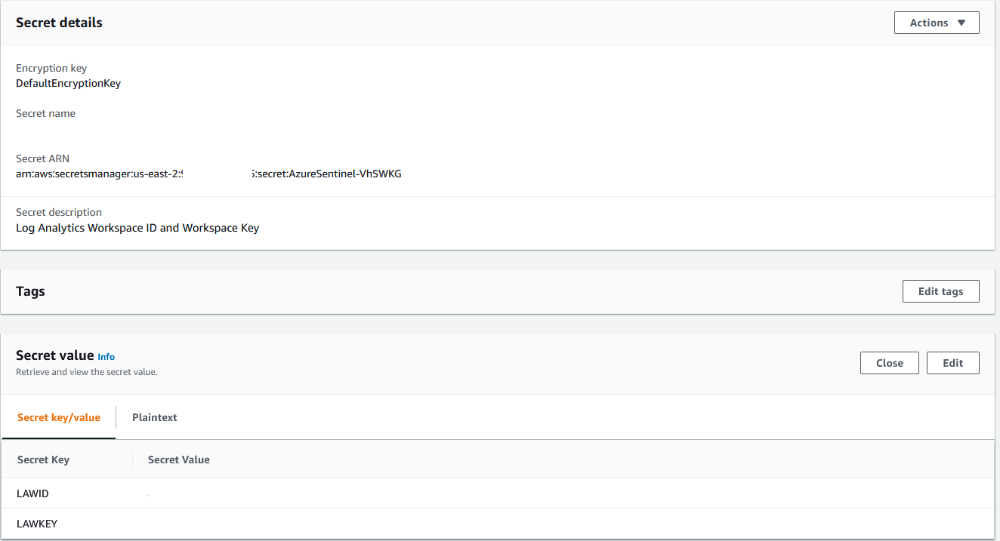
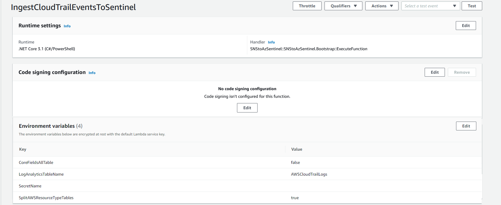
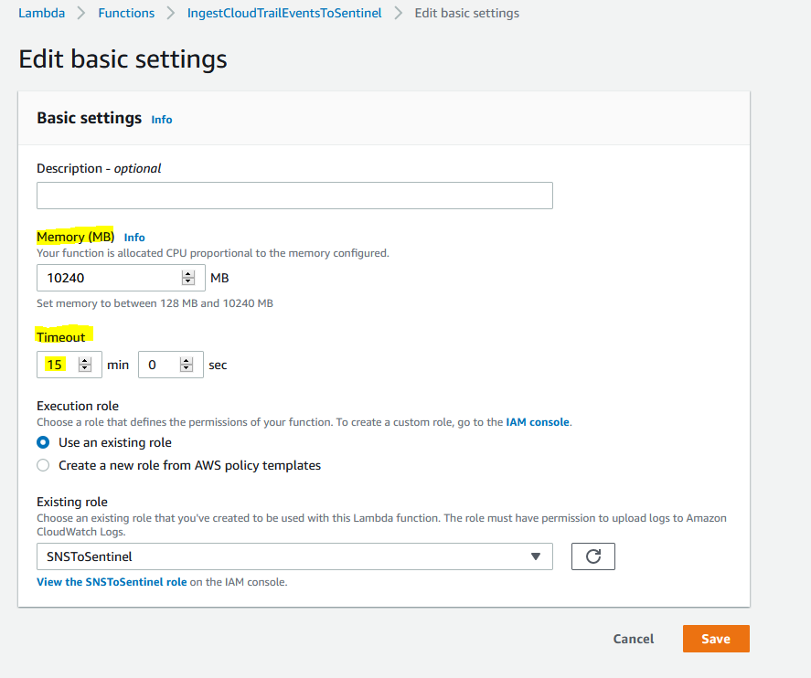
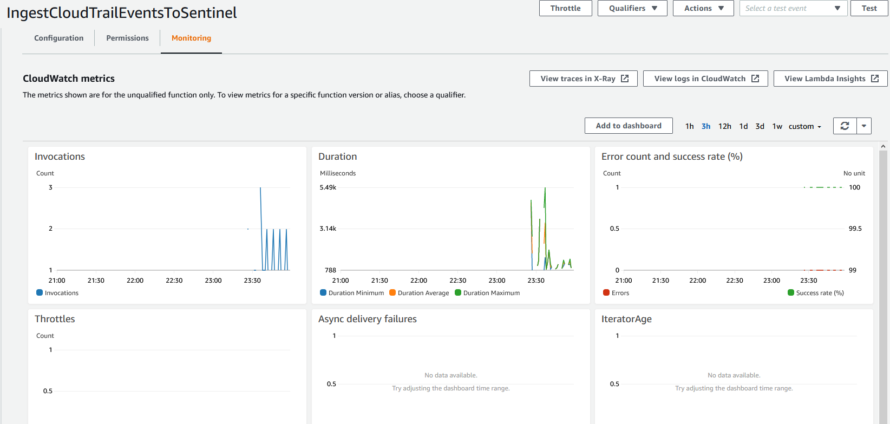
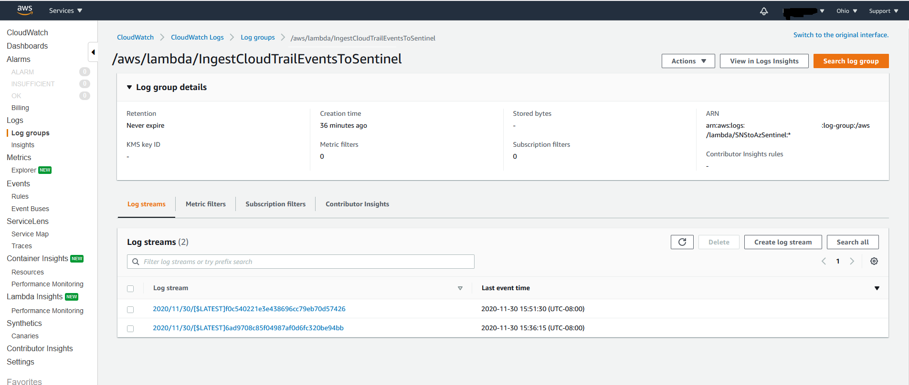
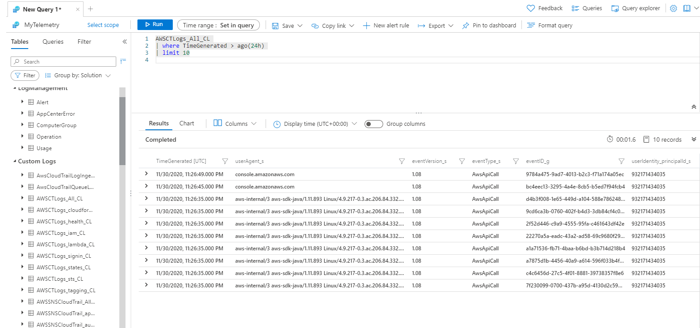

# AWS Lambda Function to import CloudTrail Logs to Azure Sentinel
Author: Sreedhar Ande

This Lambda function is designed to ingest AWS CloudTrail Events/S3 Events and send them to Azure Log Analytics workspace using the Log Analytics API.

AWS CloudTrail logs are audit type events from all/any AWS resources in a tenancy. Each AWS resource has a unique set of Request and Response Parameters. Azure Log Analytics has a column per table limit of 500, (plus some system columns) the aggregate of AWS parameter fields will exceed this quickly leading to potential loss of event records

Code does the following things with the logs it processes. 
1.	Takes the core fields of the record. i.e. all fields except for the Request and Response associated fields and puts them in a LogAnalyticsTableName_ALL. Providing a single table with all records with core event information.	
2.	Looks at each event and puts it into a table with an extension <AWSREsourceType> i.e. LogAnalyticsTableName_S3 
3.	Exception to 2 above is for EC2 events, the volume of fields for EC2 Request and Response parameters exceeds 500 columns. EC2 data is split into 3 tables, Header, Request & Response. 
	Ex: LogAnalyticsTableName_EC2_Header
4.	In future if other AWS datatypes exceed 500 columns a similar split may be required for them as well. 

**Credits**  
This Data connector uses a PowerShell logic authored by [Chris Abberley](https://github.com/cabberley)

**Note**  

To avoid additional billing and duplication: **CloudTrail Logs only**
1. You can turn off LogAnalyticsTableName_ALL using additional Environment Variable **CoreFieldsAllTable** to **true/false**
2. You can turn off LogAnalyticsTableName_AWSREsourceType using additional Environment Variable **SplitAWSResourceTypeTables** to **true/false**

**Either CoreFieldsAllTable or SplitAWSResourceTypeTables must be true or both can be true**


## **Function Flow process**
# **SNS Lambda Trigger:**
**CloudTrail/CloudWatch/GuardDuty/SecurityHub Logs --> AWS S3 --> AWS SNS Topic --> AWS Lambda --> Azure Log Analytics**


# **SQS Lambda Trigger:**
**CloudTrail/CloudWatch/GuardDuty/SecurityHub Logs --> AWS S3 --> AWS SQS --> AWS Lambda --> Azure Log Analytics**


**Note**  
Data parsing is applicable only to CloudTrail Logs. CloudWatch/GuardDuty/SecurityHub Logs will be ingested to **CoreFieldsAllTable**

## Installation / Setup Guide

## **Pre-requisites**

This function requires AWS Secrets Manager to store Azure Log Analytics WorkspaceId and WorkspaceKey


### **Option 1**

### Machine Setup
To deploy this, you will need a machine prepared with the following:
 - PowerShell Core – I recommend PowerShell 7 [found here](https://github.com/PowerShell/PowerShell/releases)
 - .Net Core 3.1 SDK [found here](https://dotnet.microsoft.com/download) 
 - AWSLambdaPSCore module – You can install this either from the [PowerShell Gallery](https://www.powershellgallery.com/packages?q=AWSLambdaPSCore), or you can install it by using the following PowerShell Core shell command:  
```powershell
Install-Module AWSLambdaPSCore -Scope CurrentUser
```
See the documentation here https://docs.aws.amazon.com/lambda/latest/dg/powershell-devenv.html 

I recommend you review https://docs.aws.amazon.com/lambda/latest/dg/powershell-package.html to review the cmdlets that are part of AWSLambdaPSCore.

Note: If the environment uses a proxy, you may need to add the following to VSCode profile
```powershell
Added to VS Code profile:
$webclient=New-Object System.Net.WebClient
$webclient.Proxy.Credentials = [System.Net.CredentialCache]::DefaultNetworkCredentials
```

### Create the Lambda Function
1.	```Get-AWSPowerShellLambdaTemplate```
2.	```New-AWSPowerShellLambda -ScriptName IngestCloudTrailEventsToSentinel -Template S3EventToSNS```  
	OR  
	```New-AWSPowerShellLambda -ScriptName IngestCloudTrailEventsToSentinel -Template S3EventToSQS```  
3.	Copy the PowerShell code from https://github.com/Azure/Azure-Sentinel/blob/master/DataConnectors/AWS-CloudTrail-Ingestion-Lambda/SNS-Lambda-Trigge/IngestCloudTrailEventsToSentinel.ps1  

5.	Paste in your code file created from Step #2  
6.	Go to script file folder  
7.	```Publish-AWSPowerShellLambda -Name YourLambdaNameHere -ScriptPath <path>/IngestCloudTrailEventsToSentinel.ps1 -Region <region> -IAMRoleArn <arn of role created earlier> -ProfileName <profile>```  
	
	Ex: ```Publish-AWSPowerShellLambda -ScriptPath .\IngestCloudTrailEventsToSentinel.ps1 -Name  IngestCloudTrailEventsToSentinel -Region us-east-2```

You might need –ProfileName if your configuration of .aws/credentials file doesn't contain a default.  See this [document](https://docs.aws.amazon.com/sdk-for-java/v1/developer-guide/setup-credentials.html) for information on setting up your AWS credentials.
 

### **Option 2**
1.	Create a new AWS Lambda and select "Author from scratch"
2.	Give Function Name and select Runtime ".NET Core 2.1 (C#/PowerShell)" and click Create function
3.	After successful creation, now you can change its code and configuration 
4.	Under Function code, click on Actions --> Upload a .zip file (/aws-data-connector-az-sentinel/blob/main/IngestCloudTrailEventsToSentinel.zip)
5.	Follow the steps in "### Lambda Configuration" from step 2

### **Note: Either you choose Option 1/Option 2, the following configuration steps are mandatory.**

### **Lambda Configuration**
1. Once created, login to the AWS console. In Find services, search for Lambda. Click on Lambda.


2. Click on the lambda function name you used with the cmdlet. Click Environment Variables and add the following
```
SecretName
LogAnalyticsTableName
CoreFieldsAllTable --> Boolean
SplitAWSResourceTypeTables --> Boolean
```

3. Click on the lambda function name you used with the cmdlet.Click Add Trigger 

4. Select SNS. Select the SNS Name. Click Add. 


5. Create AWS Role : The Lambda function will need an execution role defined that grants access to the S3 bucket and CloudWatch logs.  To create an execution role: 
	
	1. Open the [roles](https://console.aws.amazon.com/iam/home#/roles) page in the IAM console. 
	2. Choose Create role. 
	3. Create a role with the following properties. 
		 - Trusted entity – AWS Lambda. 		 
		 - Role name – AWSSNStoAzureSentinel. 
		 - Permissions – AWSLambdaBasicExecutionRole &  AmazonS3ReadOnlyAccess & secretsmanager:GetSecretValue & kms:Decrypt - required only if you use a customer-managed AWS KMS key to encrypt the secret. You do not need this permission to use the account's default AWS managed CMK for Secrets Manager

	The AWSLambdaExecute policy has the permissions that the function needs to manage objects in Amazon S3 and write logs to CloudWatch Logs. Copy the arn of the role created as you will need it for the next step. 

6. Your lambda function is ready to send data to Log Analytics.  
7. Update Lambda Memory and TimeOut  
  

### **Test the function**
1. To test your function, Perform some actions like Start EC2, Stop EC2, Login into EC2, etc.,. 
2. To see the logs, go the Lambda function.  Click Monitoring tab. Click view logs in CloudWatch. 

3. In CloudWatch, you will see each log stream from the runs. Select the latest.


4. Here you can see anything from the script from the Write-Host cmdlet. 


5. Go to portal.azure.com and verify your data is in the custom log. 


