# Automatically disable Active Directory User Account On-Prem and on Azure using a Playbook triggered in Azure

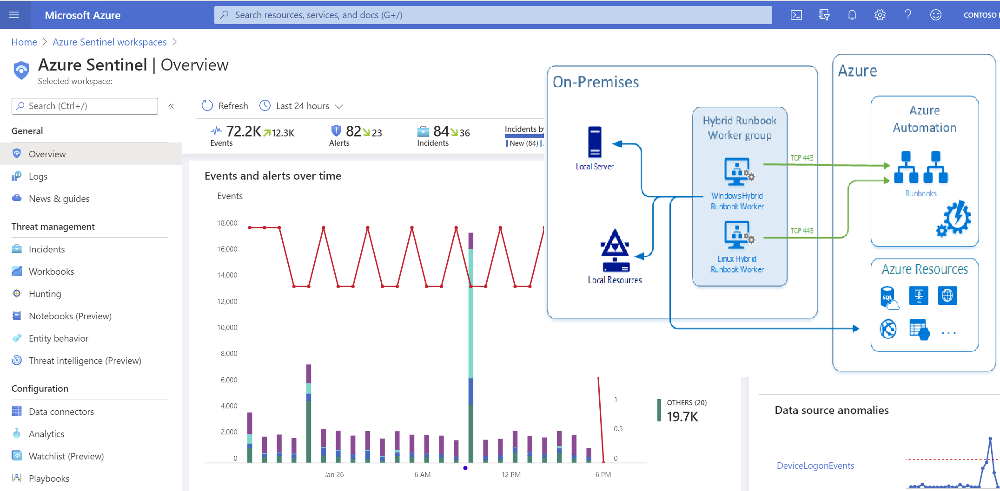

Many organizations have an on-premises Active Directory infrastructure that is synced to Azure AD in the cloud. However, given that the on-prem side is the authoritative source of truth, any changes, such as disabling a user in the cloud (Azure AD), are overridden by the setting defined in the on-prem AD during the next sync. This presents challenges when you want to orchestrate a user property change from Azure that needs to persist even after the sync happens.  To address the problem, this solution leverages the Automation Accounts and Hybrid Worker features across on-prem Windows resources & Azure . Automation Accounts can be used to perform cloud-based automation across Azure and non-Azure environments, including on Linux and Windows servers sitting in AWS, and GCP clouds so long as those machines have the Log Analytics agent installed.

## Deployment Steps

<em> [Before you begin review the pre-requisites of deploying a Hybrid Runbook Worker here:](https://docs.microsoft.com/azure/automation/automation-windows-hrw-install) </em>

Create an Automation Account 

i.	Create an Automation Account from the Azure Portal

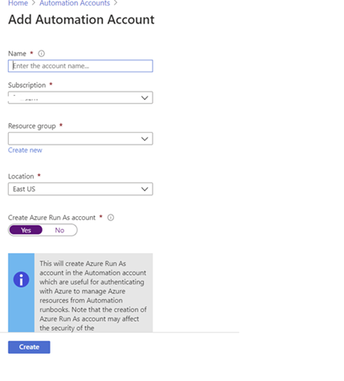

ii.	Deploy the Automation Hybrid Worker solution from the Azure Market place

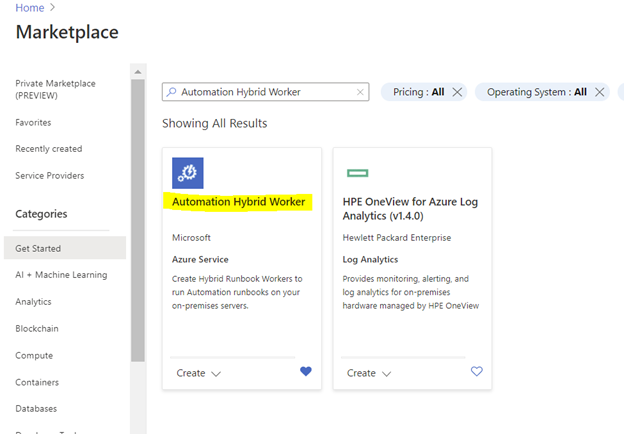

From the same Automation Account menu, create a Hybrid Worker Group

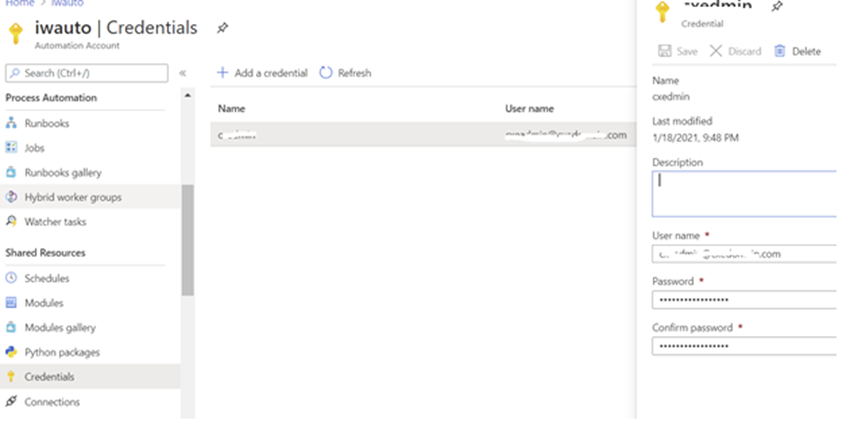

It is highly recommended that the permissions of the account used above be restricted to the minimum required to disable user accounts using the Delegation userAccountControl bit mask. More details can be found [here](https://docs.microsoft.com/troubleshoot/windows-server/identity/useraccountcontrol-manipulate-account-properties)

To create a new PowerShell Runbook navigate to you Automation Account and select the Runbooks blade. 

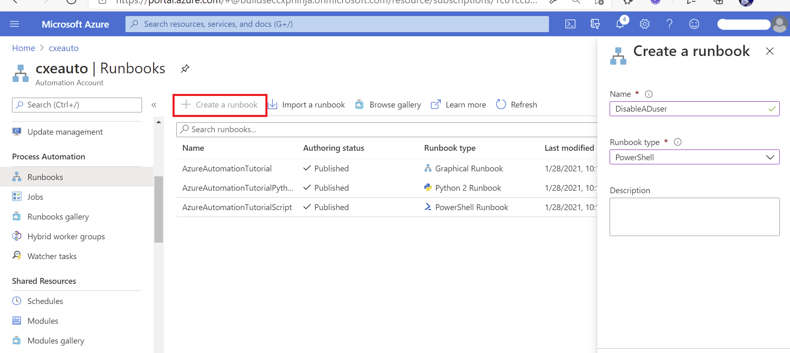

Select PowerShell from the Runbook type menu and paste the below script in the resulting window. Click save then publish to activate the Runbook. 
Note: the script also includes code to report an error in case of a failure in the process of disabling the account:

Create a new PowerShell Runbook with the below script, save and publish it. In case of a failure in the process of disabling the account then the script will notify you as well:

    Param (
    [string] $SAMAccountName
        )

        if (Get-WindowsFeature  -Name rsat) {
	    Write-Output "Remote Server Tools already installed on host"
    }
    else {
	 Write-Output "Remote Server Tools module does not exist on host. Installing..."
	 try {
	 Install-WindowsFeature -IncludeAllSubFeature RSAT -WhatIf
	 } 
	 catch{ 
		 Write-Error "Error installing Remote Server Administration Tools"
		 throw $_
		 break
		} 
		Write-Output "Remote Server Administration Tools installed"
	}

    if (Get-Module -ListAvailable -Name ActiveDirectory) {
    Write-Output "ActiveDirectory PowerShell module already exists on host."
    } 
    else {
    Write-Output "ActiveDirectory PowerShell module does not exist on host. Installing..."
    try {
        Import-Module ActiveDirectory
    }
    catch{
        Write-Error "Error installing ActiveDirectory PowerShell module."
        throw $_
        break
    }

    Write-Output "ActiveDirectory PowerShell module installed."
}

    if (Get-Module -ListAvailable -Name ActiveDirectory) {
    Write-Output "ActiveDirectory PowerShell module already exists on host."
    } 
    else {
    Write-Output "ActiveDirectory PowerShell module does not exist on host. Installing..."
    try {
        Import-Module ActiveDirectory
    }
    catch{
        Write-Error "Error installing ActiveDirectory PowerShell module."
        throw $_
        break
    }

    Write-Output "ActiveDirectory PowerShell module installed."
    }
    Write-Output "Finding and disabling user $SAMAccountName"
    try {
    Get-ADUser -Identity $SAMAccountName | Disable-ADAccount
    }
    catch {
    Write-Error "Error disabling user account $SAMAccountName"
    throw $_
    break
    }
    Write-Output "Successfully disabled user account $SAMAccountName"

The script takes in a SAMAccountName parameter which it uses to find the appropriate user and disable the account. This script can be modified to do a variety of other tasks, such as password resets, adding/removing users to/from groups, etc.

Create a test user in Active Directory then perform the steps in the on-prem machine to install the Hybrid Worker feature 

Deploy the below script from this URL: PowerShell Gallery | New-OnPremiseHybridWorker 1.7 . Depending on the PowerShell module currently installed on your machine you may need manually download the file. If you do so, you will need to rename the extension to a .zip file first then extract to the directory where you’ll execute the script from.

This script performs the following actions:
1) Install the necessary modules
2) Login to an Azure account
3) Check for the resource group and automation account
4) Create references to automation account attributes
5) Create an Log Analytics Workspace if needed
6) Enable the Azure Automation solution in Log Analytics
7) Download and install the Microsoft Monitoring Agent
8) Register the machine as hybrid worker

To register your HybridWorker in Azure add the details of your hybrid runbook into the parameters to be passed to the creation command execute the below statement at your PowerShell prompt:
$NewOnPremiseHybridWorkerParameters = @{
  AutomationAccountName = "iwauto"
  AAResourceGroupName   = "AD-Onprem"
  OMSResourceGroupName  = "AD-Onprem"
  HybridGroupName       = "AutoGroup"
  SubscriptionID        = "xxxxxxxxxxxxxxxx"
  WorkspaceName         = "iwautola"}

From the same PowerShell command prompt type: Install-Script -Name New-OnPremiseHybridWorker which will use parameters specified above 
This command will open a log on screen to Azure Portal to register the Hybrid Worker in Azure 

The command will use parameters specified above to register your HybridWorker Group in your Azure Subscription. You can learn more about the process of deploying Hybrid Workers [here](https://docs.microsoft.com/azure/automation/automation-windows-hrw-install) 

The command will open a log on screen in Azure Portal to register the Hybrid Worker in Azure

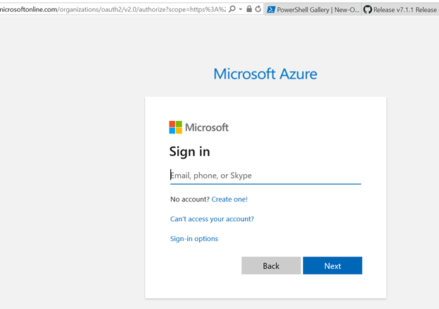

To confirm successful registration, navigate to your automation account then select Hybrid worker groups. You should see the recently registered Hybrid Worker group in the list per below screen shot.

<em> If you get the error indicating that the PowerShell file is not digitally signed, then you will need to execute the command below:

Set-ExecutionPolicy RemoteSigned
You may still have to unblock the file in case changing the execution policy alone does not work. The command to do this is from a PowerShell prompt is: 
Unblock-File -Path .\New-OmPremiseHybridWorker.ps1

More details here: [Set-ExecutionPolicy (Microsoft.PowerShell.Security](https://docs.microsoft.com/powershell/module/microsoft.powershell.security/set-executionpolicy?view=powershell-7.1) 

It is also recommended that you use TLS versions more recent than 1.0 and 1.1. For this reason you may be required to run the below command as well:

[Net.ServicePointManager]::SecurityProtocol = [Net.SecurityProtocolType]::Tls12
</em>

[You can learn more about the process of deploying Hybrid Workers here](https://docs.microsoft.com/azure/automation/automation-windows-hrw-install)

On successful registration you should see an output similar to the below:

To confirm successful registration, navigate to your automation account then select Hybrid worker groups. You should see the recently registered hybrid worker group in the list per below screen shot.

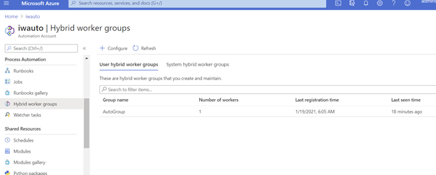

### Test the Runbook 
To ensure the Runbook is working ok before integrating with a Logic App, execute the Runbook manually from the Azure Portal and specify a test account in the SAMAccountName box, select HybridWorker in the Run Settings section and then choose your Hybrid Worker group name from the drop-down list:

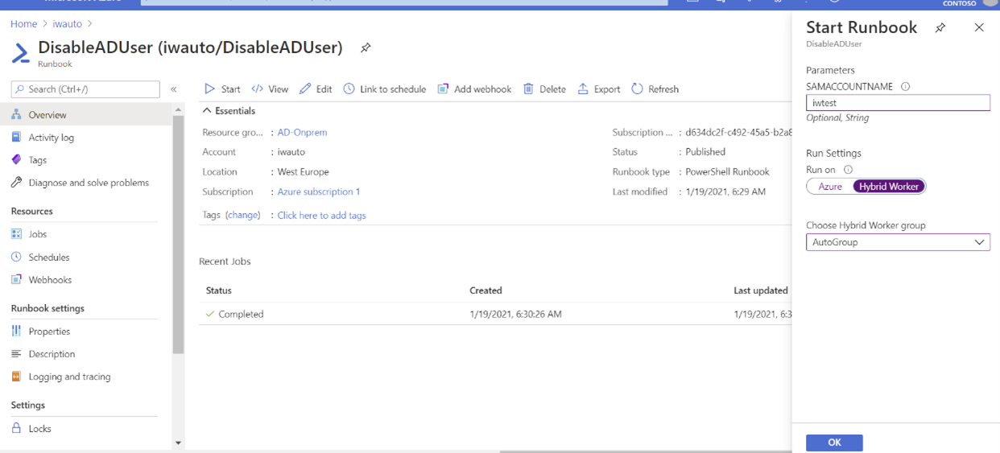

### Steps to orchestrate from Azure Sentinel/Logic Apps
Below is the structure of the orchestration Logic App that triggers the runbook to disable qualifying accounts from the On-Prem AD. With this action the next on-prem to cloud AD sync will maintain the state on the account – in this case disabled, until the setting is reversed from the on-prem Active Directory.

## High-Level structure of the Playbook

## Detailed structure of the Playbook:
## Extract entity details (to capture user ID) following trigger execution

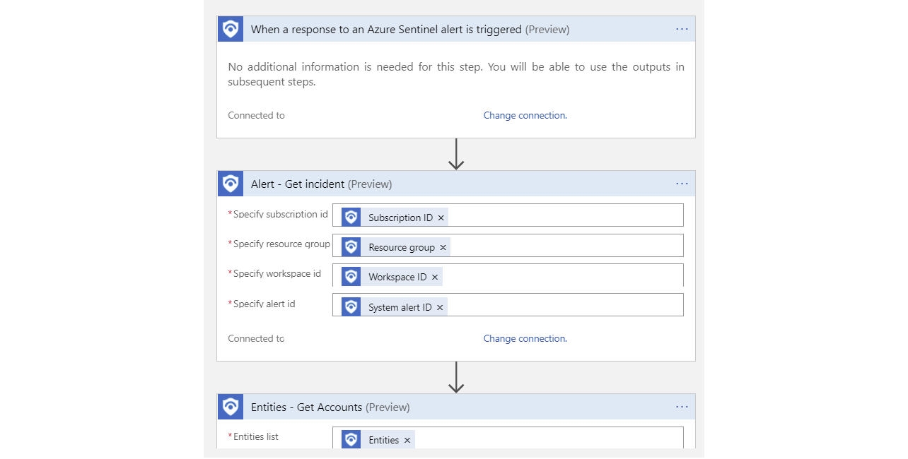

Parse the JSON output from the Entities-Get Actions step above in order to extract the Azure User ID and SAM Account name needed to perform disable operations-first on Azure then on the On-Prem Active directory.

## Disable Account in Azure AD

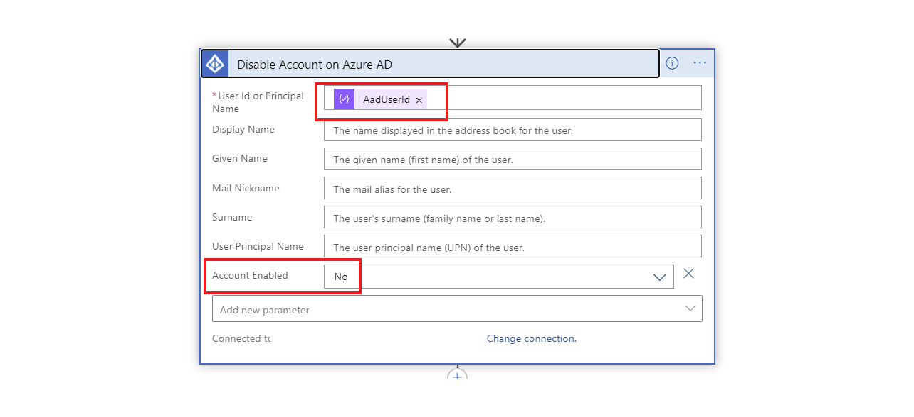

## Create Hybrid Automation Job 
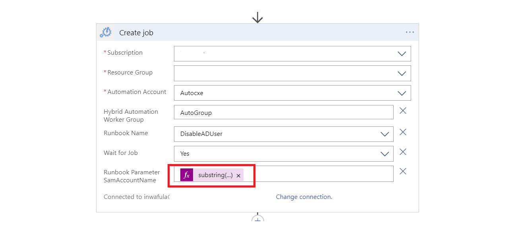

The string function below is contained in the 'Runbook Parameter SamAccountName' above and is needed to extract the SAMAccount from the UPN of the user as the On-Prem AD can only act on the User ID when specified in this format:

    substring(body('Parse_JSON')?['Name'], 0, sub(length(body('Parse_JSON')?['Name']),indexOf(body('Parse_JSON')?['Name'],'@')))

To simulate the block orchestration from Azure Sentinel, you may use the below sample query to create an Analytics rule that will detect a failed log on due to a wrong password entered on Azure AD portal. You can then simulate failed log on attempts with the account you wish to test with.

    SigninLogs
    | where Location == "KE" and Identity contains "mytestaccount" and ResultType =="50126"
    | extend AccountCustomEntity = AlternateSignInName

[Troubleshooting guide for Hybrid Runbook Workers can be found here](https://docs.microsoft.com/azure/automation/troubleshoot/hybrid-runbook-worker)

<em>Special thanks to [Hazem Elshabini](https://github.com/helshabini) for his valuable collaboration in building the Playbook & [Yaniv Shasha](https://github.com/Yaniv-Shasha) for suggestions to enhance the solution.</em>

