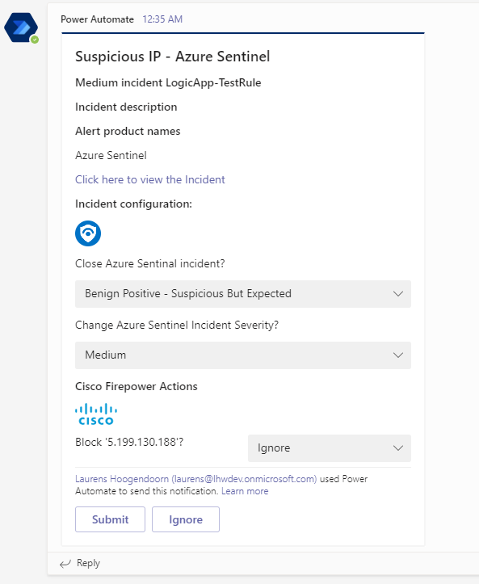
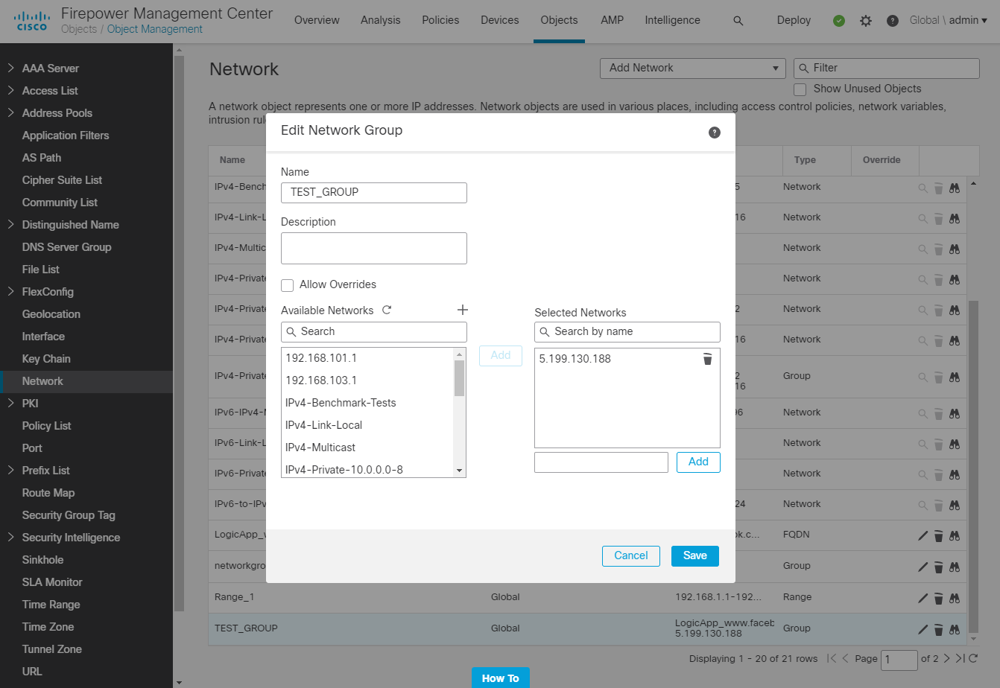
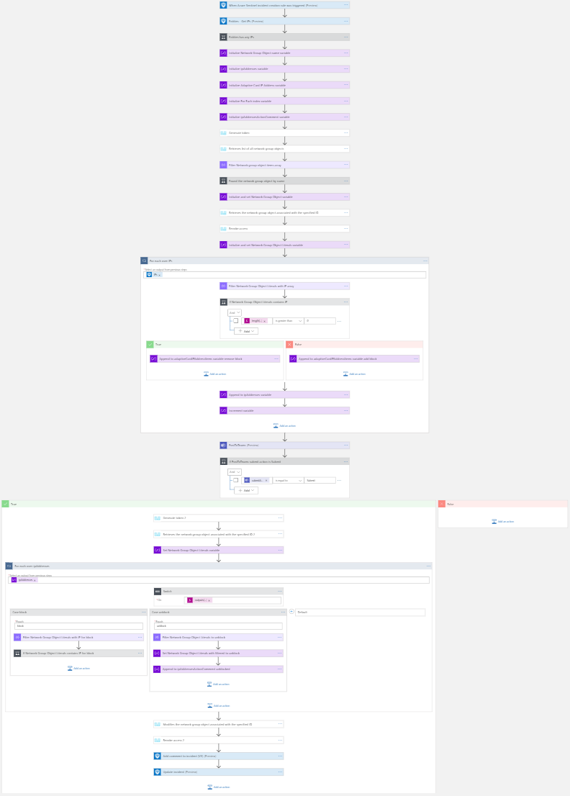

# Cisco Firepower - Add IP Addresses to a Network Group object with Teams

## Summary

This playbook allows blocking of IPs in Cisco Firepower, using a **Network Group object**. This allows making changes to a Network Group selected members, instead of making Access List Entries. The Network Group object itself should be part of an Access List Entry.

When a new Sentinel incident is created, this playbook gets triggered and performs below actions.
1. For the IPs we check if they are already selected for the Network Group object
2. An adaptive card is sent to a Teams channel with information about the incident and giving the option to ignore an IP, or depdening on it's current status block it by adding it to the Network Group object or unblock it by removing it from the Network Group object
    
3. The chosen changes are applied to the Network Group object
3. Comment is added to Azure Sentinel incident
    

** IP is added to Cisco Firepower Network Group object:**

**Plabook overview:**

### Prerequisites
1. **This playbook template is based on Azure Sentinel Incident Trigger which is currently in Private Preview (Automation Rules).** You can change the trigger to the Sentinel Alert trigger in cases you are not part of the Private Preview.
2. Cisco Firepower custom connector needs to be deployed prior to the deployment of this playbook, in the same resource group and region. Relevant instructions can be found in the connector doc pages.
3. In Cisco Firepower there needs to be a Network Group object. [Creating Network Objects](https://www.cisco.com/c/en/us/td/docs/security/firepower/630/configuration/guide/fpmc-config-guide-v63/reusable_objects.html#ariaid-title15)

### Deployment instructions 
1. Deploy the playbook by clicking on "Depoly to Azure" button. This will take you to deplyoing an ARM Template wizard.

2. Fill in the required paramteres:
    * Playbook Name: Enter the playbook name here (ex:CiscoFirepower-BlockIP-Teams)
    * Cisco Firepower Connector name: Enter the name of the Cisco Firepower custom connector (default value:CiscoFirepowerConnector)
    * Network Group object name: The name of the Network Group object.

### Post-Deployment instructions 
#### a. Authorize connections
Once deployment is complete, you will need to authorize each connection.
1.	Click the Azure Sentinel connection resource
2.	Click edit API connection
3.	Click Authorize
4.	Sign in
5.	Click Save
6.	Repeat steps for other connections such as Teams and Cisco Firepower (For authorizing the Cisco Firepower API connection, the username and password needs to be provided)

#### b. Select Teams channel
The Teams channel to which the adaptive card will be posted will need to be configured.
1. Click the Azure Logic app resource
2. Edit the Logic App
3. Find the 'PostToTeams' action
4. Select a Team and Channel
5. Save the Logic App

#### c. Configurations in Sentinel
1. In Azure sentinel analytical rules should be configured to trigger an incident with IP Entity.
2. Configure the automation rules to trigger this playbook
