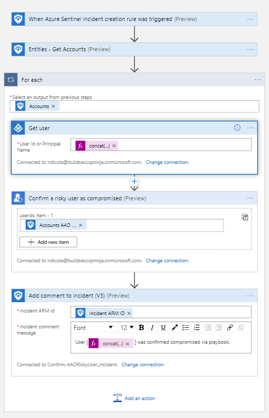

# Confirm-AADRiskyUser
author: Nicholas DiCola

This playbook will set the Risky User property in AAD using Graph API.

## Quick Deployment
**Deploy with incident trigger** (recommended)

After deployment, attach this playbook to an **automation rule** so it runs when the incident is created.

[Learn more about automation rules](https://docs.microsoft.com/azure/sentinel/automate-incident-handling-with-automation-rules#creating-and-managing-automation-rules)

**Deploy with alert trigger**

After deployment, you can run this playbook manually on an alert or attach it to an **analytics rule** so it will rune when an alert is created.

## Prerequisites

- You will need to add the managed identity that is created by the Logic App to the Security Administrator role in Azure AD.

## Screenshots
**Incident Trigger** 
 
**Alert Trigger** 
