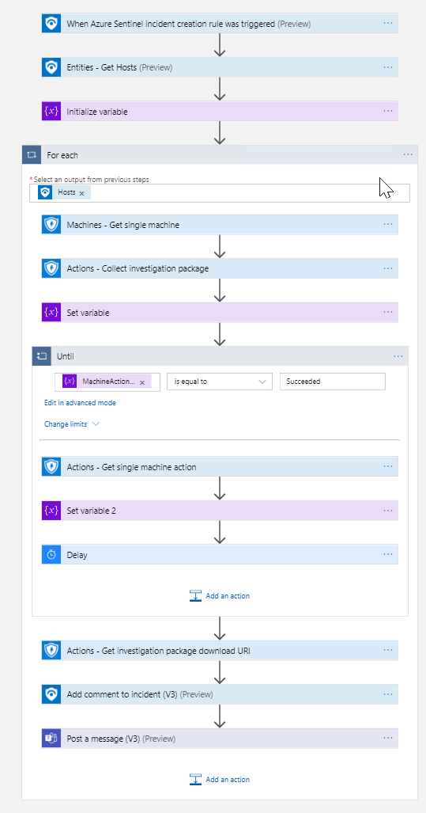
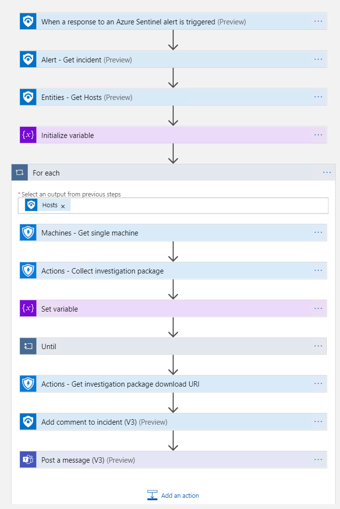

# Get-MDEInvestigationPackage
author: Nicholas DiCola

This playbook will call the collect investigation package in MDE.  It will then loop until thats complete, once complete it will add a comment to the incident and post a message in teams with the URL to download the package.

## Quick Deployment
**Deploy with incident trigger** (recommended)

After deployment, attach this playbook to an **automation rule** so it runs when the incident is created.

[Learn more about automation rules](https://docs.microsoft.com/azure/sentinel/automate-incident-handling-with-automation-rules#creating-and-managing-automation-rules)

**Deploy with alert trigger**

After deployment, you can run this playbook manually on an alert or attach it to an **analytics rule** so it will rune when an alert is created.

## Prerequisites

- You will grant permissions for the managed identity to the Graph Application. There is a good blog [here](https://laurakokkarinen.com/authenticating-to-azure-ad-protected-apis-with-managed-identity-no-key-vault-required/). You will need to grant at least "ChatMessage.Send" for the managedid in the Graph Application.
- [This](https://www.linkedin.com/pulse/3-ways-locate-microsoft-team-id-christopher-barber-/) blog shows some simple methods to get the Team Id.  You will need the Team Id and Channel Id.

## Screenshots
**Incident Trigger**

**Alert Trigger**
