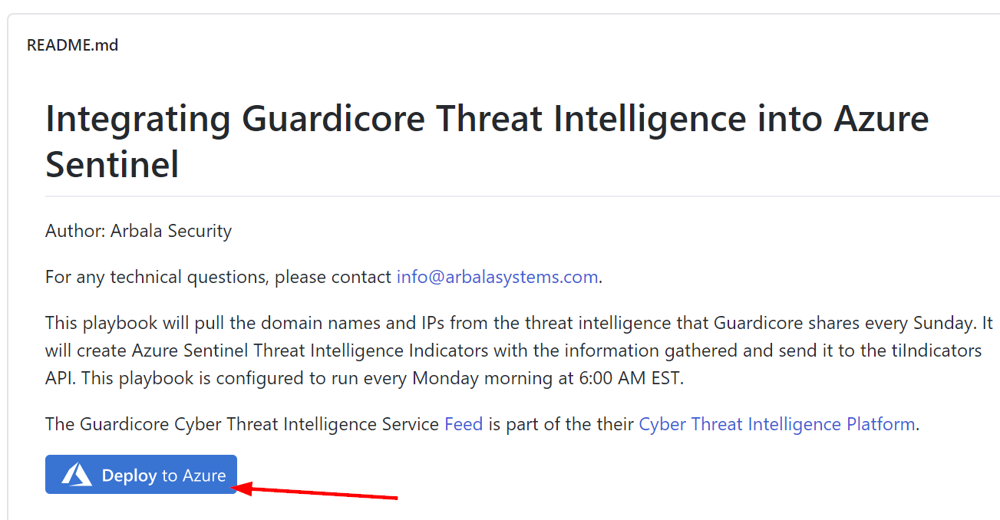
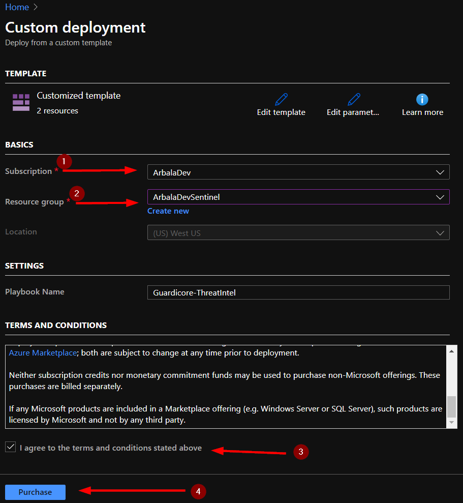
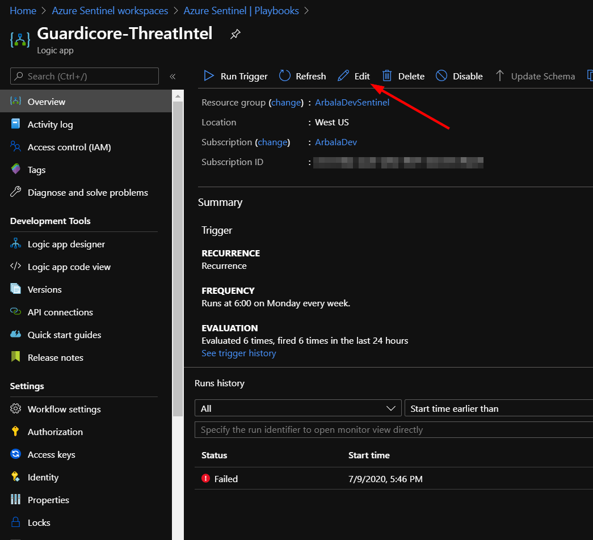
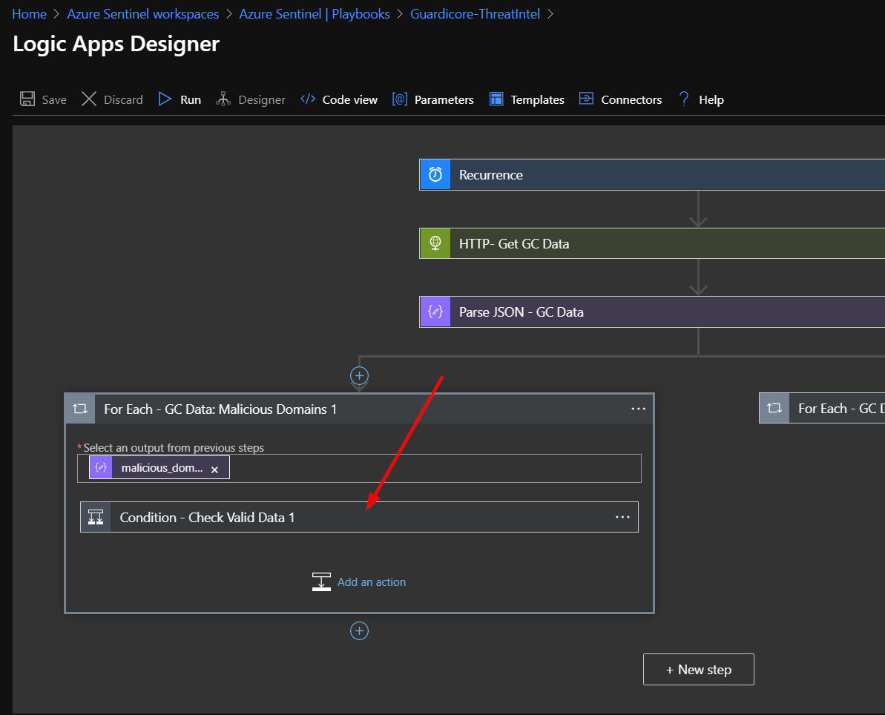
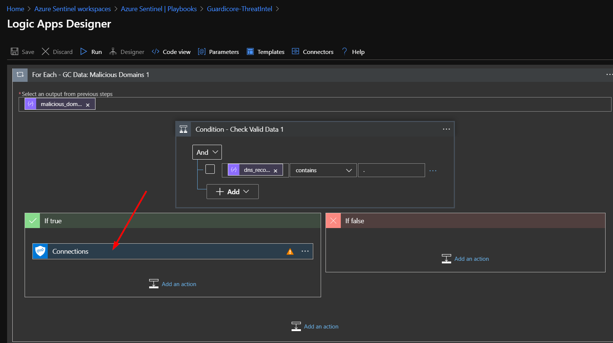
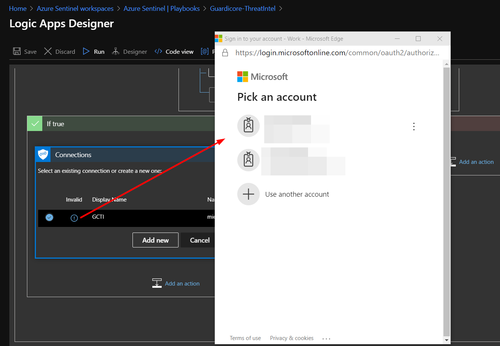
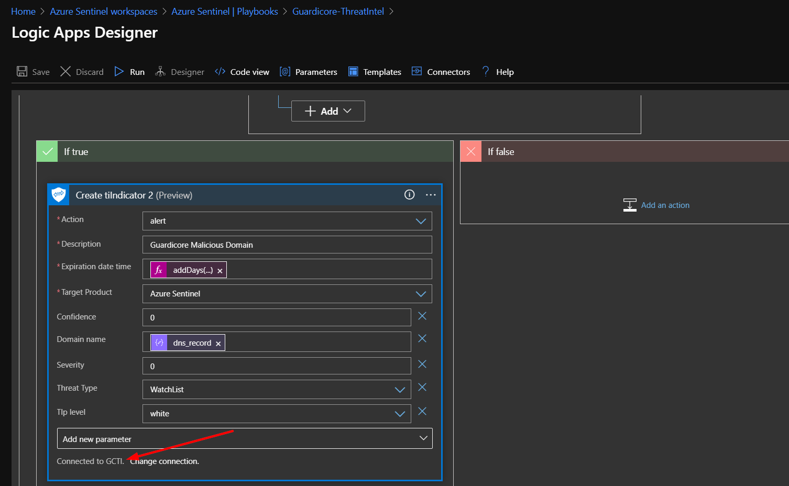

# Integrating Guardicore Threat Intelligence into Azure Sentinel

Author: Arbala Security

For any technical questions, please contact info@arbalasystems.com.

This playbook will pull the domain names and IPs from the threat intelligence that Guardicore shares every Sunday. It will create Azure Sentinel Threat Intelligence Indicators with the information gathered and send it to the tiIndicators API. This playbook is configured to run every Monday morning at 6:00 AM EST.

The Guardicore Cyber Threat Intelligence Service [Feed](https://threatintelligence.guardicore.com/download-guardicore-cyber-threat-intelligence-data) is part of the their [Cyber Threat Intelligence Platform](https://threatintelligence.guardicore.com/).

  
 # 
Open your browser and ensure you are logged into your Azure Sentinel workspace. In a separate tab, open the link to our playbook on the Arbala Security GitHub Repository:

https://github.com/Arbala-Security/Guardicore-ThreatIntel

From there, click the “Deploy to Azure” button at the bottom and it will bring you to the Custom Deployment Template.

In the **BASICS** section:  

* Select the “**Subscription**” and “**Resource Group**” from the dropdown boxes you would like the playbook deployed to.  

In the **SETTINGS** section:   

* **Playbook Name**: This can be left as “Guardicore-ThreatIntel” or you may change it.  

Towards the bottom ensure you check the box accepting the terms and conditions and then click on “Purchase”. 

The playbook should take less than a minute to deploy. Return to your Azure Sentinel workspace and click on “Playbooks.” Next, click on your newly deployed playbook. Don’t be alarmed to see that the status of the playbook shows failed. We still need to edit the playbook to set up a valid connection on our Microsoft Graph Security connectors.  

Click on the “Edit” button. This will bring us into the Logic Apps Designer.

Click on the bottom left bar labeled “For Each - GC Data: Malicious Domains 1”. 

Click on the bar labeled “Condition - Check Valid Data 1”. 

Click on “Connections”.  

Click on the circled exclamation point under the word "Invalid". 

This will prompt you to sign in with your credentials.

You should see the that the “Create tiIndicator 2” box has updated and displays “Connected to GCTI.” Click the X to close the Logic App Designer. There is no need to click a save button. 

This process will not need to be repeated for the right hand branch. 

# Developer's Note:
The branching for the same outer loops is necessary because not all Guardicore domains and IP addresses are in a format Microsoft Graph will accept as valid. 
The branching allows a domain name and its associated IP addresses to be ingested separately.
This way, an invalid domain name will not negate its associated valid IP addresses, or vice versa.

For any technical questions, please contact info@arbalasystems.com.
