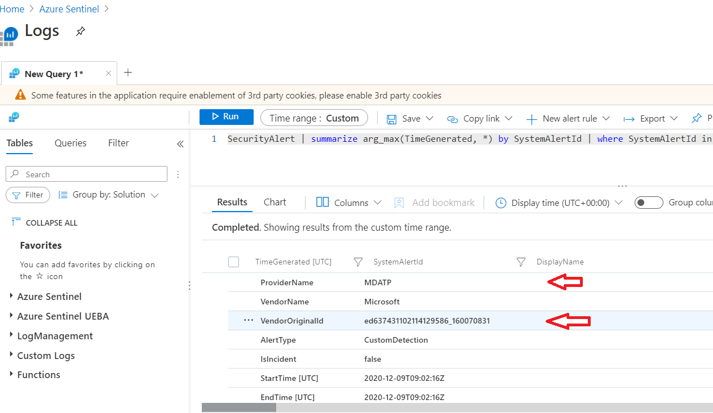
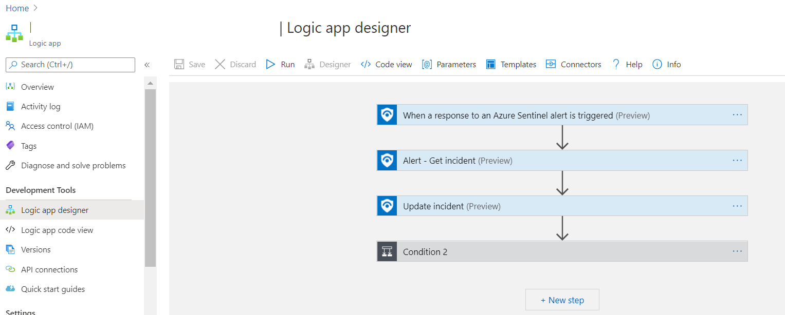
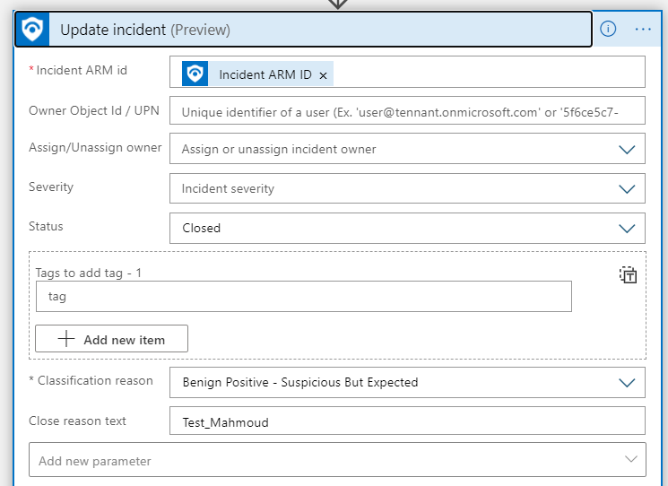

## This playbook will sync incident status in Azure sentinel to the corresponding incident in MDATP

**Description**

A question that always get flagged when working on Azure sentinel specially in organizations where implementation of E5 is adopted at full scale that is:

When closing an incident in Azure sentinel will incident status get closed in let's say MDATP portal as well ?

The short answer is NO it simply won't! and this answer is applicable only to the very moment this article was written as Microsoft is bringing a lot of new features every second!

Likely there is an easy way to do this and it's also meeting best practices by utilizing the playbooks in Azure sentinel itself.

In following lines we can see an example of how to do this:

The bottom line when exploring whether it could be possible technically to sync an incident status between sentinel and MDATP is to find a common matching criteria between the two entities. let's look at following incident in Azure sentinel for instance:

 

If you click on the incident and then from the right pane click on "Alerts" you will be taken to the page that shows the query result as shown in following screens:

what we would be interested to see is in particular the VendorOriginID attribute

which represents the Alert ID as it is stored in MDATP originally (from the source)

So apparently this is the matching attribute that we can use to build up the playbook.

following is an example of a sample playbook for demonstration:

This is how the logic app (Playbook) looks like:

looking at the steps:

**Step#1**: When a response to an Azure Sentinel alert is triggered:

This step simply implies when the playbook will be triggered

**Step#2:** Alert - Get incident

In this step we will need to fill it up with dynamic attributes

**Step#3:** Update incident

In this step we set the incident status to "Closed" in Sentinel

**Step#4:** Condition:

Now it's time to set the condition and actions required to finish the task.

the condition i used here is to set dynamic content attribute to: "Incident Alert product names"

if condition is met then next step would be to set the corresponding alert status in MDATP to "Resolved"

Here we will come to use the actual matching attribute called "provider alert ID" which is exactly same as VendorOriginID mentioned above

Note also here that we retrieved attribute "provider Alert ID" and used the MDATP connector to pass it to. So it's exactly like sending a query to MDATP with the specific alert id ed637431102114129586_160070831 in order to set it to "resovled"

**Step#5:** testing the playbook in action:

As you see above it was able to pull the alert ID ed637431102114129586_160070831 that is equal to the VendorOriginID in order to query for it in MDATP and close the alert.

As mentioned already this playbook represents just an example and I do believe that more is coming on the way by Microsoft to make it even easier ..

hope it helps.