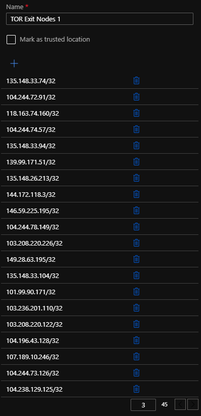
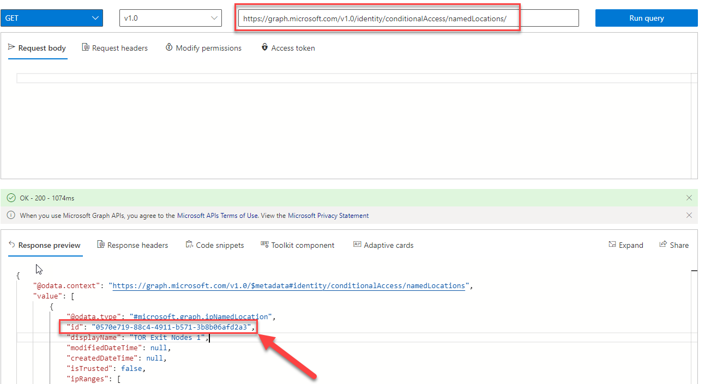
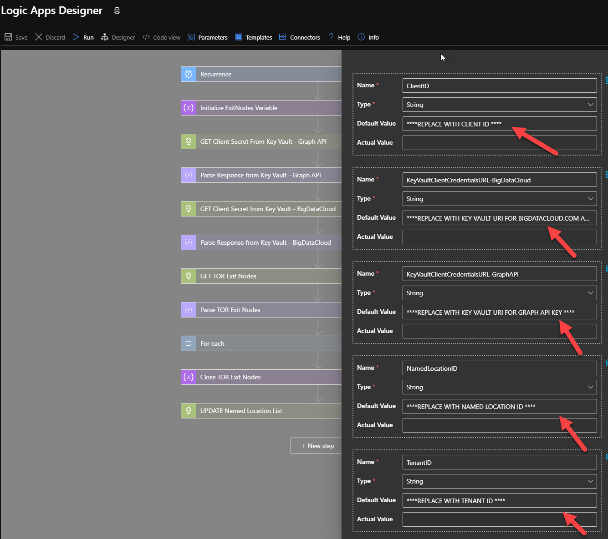
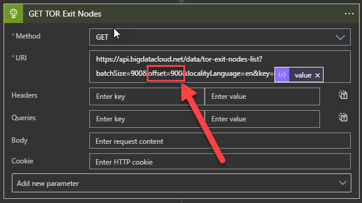
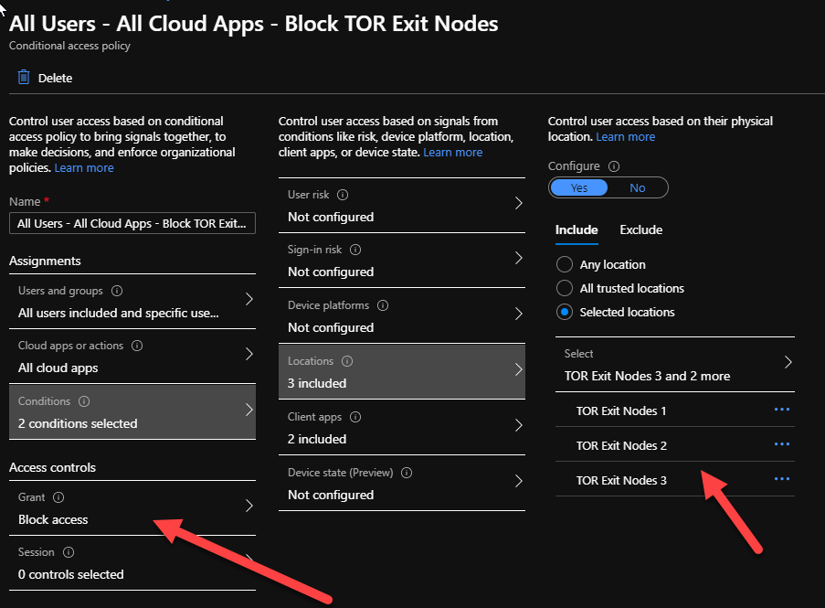

# Tutorial: Synchronize TOR Exit Nodes to Azure AD Named Location List using the free Big Data Cloud API

Intent: As an IT admin, I want to be able to block logins from all TOR Exit Node IP Addresses using Conditional Access.

Although Azure Identity Protection can detect anomalous login activity from anonymous IP addresses, sometimes it's worthwhile to have a list of all the known TOR Exit Nodes. These could be used as Threat Indicators within Azure Sentinel, or in this case in a Named Location list that can be acted upon with Conditional Access.

Big Data Cloud has a free API (https://www.bigdatacloud.com/insights-apis/tor-exit-nodes-geolocated-api) that synchronizes the list of known TOR Exit nodes on an hourly basis. We can utilize this API to synchronize this list of IP Addresses into a Named Location list using this Playbook.

   

## Prerequisites

If you don't have an Azure subscription, create a [free Azure account](https://azure.microsoft.com/free/?WT.mc_id=A261C142F) before you start.

This Logic App retrieves API keys from Key Vault and as such you should review and complete the steps in the article [Secure authentication for Conditional Access automation](https://github.com/Azure-Samples/azure-ad-conditional-access-apis/blob/main/00-prereq/readme.md) to create a Key Vault and connect to Managed Identity.

This Logic App will require Graph API Permissions to [Update ipNamedlocation](https://docs.microsoft.com/en-us/graph/api/ipnamedlocation-update?view=graph-rest-1.0&tabs=http) - Policy.Read.All and Policy.ReadWrite.ConditionalAccess.

This Logic App will require Sign-up (free) and an API Key generated for Big Data Cloud - https://www.bigdatacloud.com/insights-apis/tor-exit-nodes-geolocated-api. Store this Key in Azure Key Vault that your Managed Identity has access to and note the URI for secret retrieval.

You will need an [Azure AD Named Location](https://docs.microsoft.com/en-us/azure/active-directory/reports-monitoring/quickstart-configure-named-locations) created to store Tor Exit Node IP Addresses. Each Named Location is only capable of holding 1000 IP Addresses. As a result you will need at least 3 to hold all the TOR Exit Node IP Addresses (~2800 at time of publishing this Playbook). Once you create them, use Graph Explorer to retireve the Named Location ID using [Get namedLocation](https://docs.microsoft.com/en-us/graph/api/namedlocation-get?view=graph-rest-1.0&tabs=http).

## Step 1: Deploy this logic app to your organization

If your Azure environment meets the prerequisites, and you're familiar with using Azure Resource Manager templates, these steps help you sign in directly to Azure and open the Azure Resource Manager template in the Azure portal. For more information, see the article, [Deploy resources with Azure Resource Manager templates and Azure portal](https://docs.microsoft.com/azure/azure-resource-manager/templates/overview).

Select the following image to sign in with your Azure account and open the logic app in the Azure portal:

   

1. In the portal, on the **Custom deployment** page, enter or select these values:

   | Property | Value | Description |
   |----------|-------|-------------|
   | **Subscription** | <*Azure-subscription-name*> | The name for the Azure subscription to use |
   | **Resource group** | <*Azure-resource-group-name*> | The name for a new or existing Azure resource group |
   | **Region** |  <*Azure-region-for-all-resources*> | The Azure region to use for all resources, if different from the default value. This example uses the default value, `[resourceGroup().location]`, which is the resource group location. |
   | **Client ID** | <*ClientID*> | The Client ID of your App Registration with Graph API Permissions.|
   | **Tenant ID** | <*TenantID*> | The Azure AD Tenant ID where your App Registration Resides.|
   | **Named Location ID** | <*NamedLocationID*> | The GUID of your Named Location List to Update - Find the GUID with Graph Explorer.|
   | **Key Vault Client Credentials URL-Big Data Cloud** | <*KeyVaultClientCredentialsURL-BigDataCloud*> | The URL for your Big Data Cloud API Key Secret from Azure Key Vault|
   | **Key Vault Client Credentials URL-GraphAPI** | <*KeyVaultClientCredentialsURL-GraphAPI*> | The URL for your Big Data Cloud API Key Secret from Azure Key Vault|

1. When you're done, select **Review + Create** and finally **Create**.

## Step 2: Authenticate your logic app to Azure AD with the right permissions

This logic app uses Managed Identity to access secrets from Key Vault to call the Graph API. As a prerequisite you must have completed the steps in the article [Secure authentication for Conditional Access automation](https://github.com/Azure-Samples/azure-ad-conditional-access-apis/blob/main/00-prereq/readme.md) to create a Key Vault and connect to Managed Identity. To learn more about how to use managed identities within Logic Apps, see the article [**Logic Apps and Managed Identities**](https://docs.microsoft.com/azure/logic-apps/create-managed-service-identity).

1. In the left-hand navigation pane, select Identity > User Assigned > Select Add.

1. Select the User-assigned managed identity from the context pane that appears on the right, select Add.

   

## Step 3: Update parameters

1. In the left-hand navigation pane, select Logic App designer > Parameters > Ensure all the default values are updated with Key Vault URI (storing Client Secrets), Client ID and Tenant ID, and Named Location ID.

   

## Step 4: Select appropriate managed identity

1. On the Logic App Designer, in the HTTP connection box, click `GET client secret from key vault - Graph API`. This example uses HTTP connector.

2. Specify the Managed Identity to use.

   

Repeat the above for the step `GET client secret from key vault - BigDataCloud`

This will give the Managed Identity the ability to retrieve both the Graph API and Big Data Cloud API Key's from Azure Key Vault.

> [!WARNING]
> Ensure you follow best practices regarding managing secrets within Logic apps by using secure inputs and outputs as documented in the article, [Secure access and data in Azure Logic Apps]](https://docs.microsoft.com/azure/logic-apps/logic-apps-securing-a-logic-app).

## Next steps

As Named Locations only support up to 1000 IP Addresses you will need to deploy this Logic App 3 times and make the following minor adjustments.

1. During deployment use the same parameters with the exception of a new Named Location ID

2. Edit the Logic App and modify the `Get TOR Exit Nodes` step and change the `offset=0` value to `offset=900`. This will use the Big Data Cloud API to pull the TOR Exit Node IP's for 900 to 1800, repeat again for `offset=1800` and `offset=2700`.

You should end up with 4 Logic Apps and 4 Named Locations, each responsible for updating a portion of the known TOR Exit Nodes, which at the time of writing is around 2800 IP Addresses.

Finally you can configure a [Conditional Access rule](https://docs.microsoft.com/en-us/azure/active-directory/conditional-access/concept-conditional-access-conditions#locations) to block logins from the newly created list of TOR Exit Nodes.

