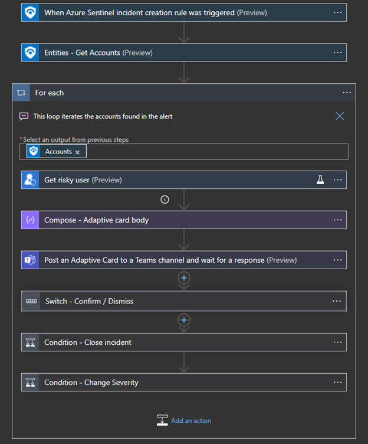
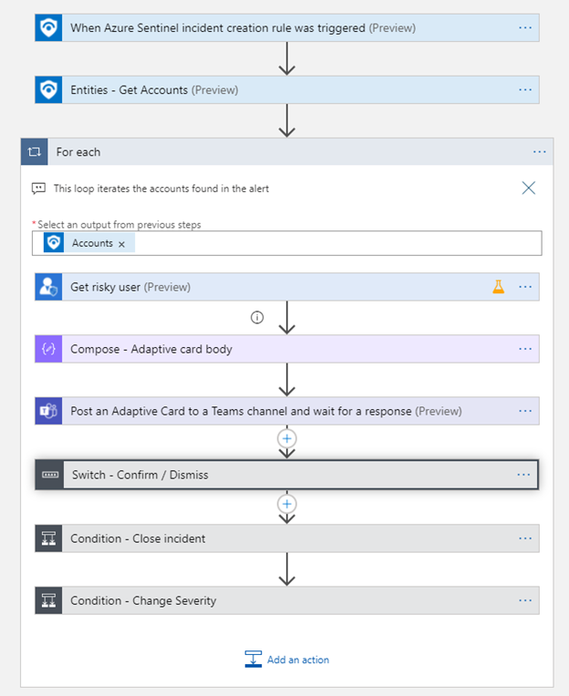
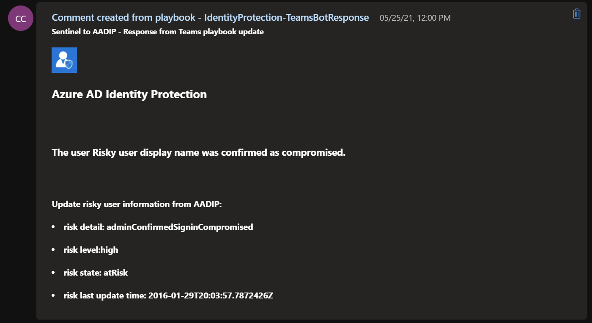
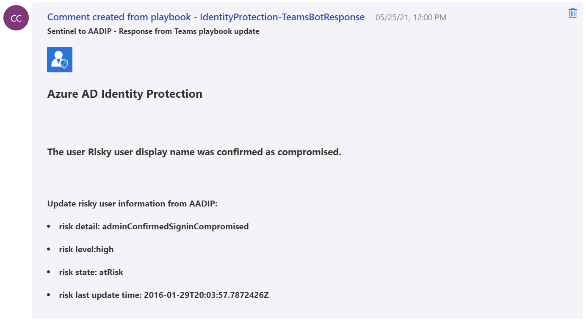

# Contribution guidelines for Azure Sentinel playbooks gallery

This document guides how to contirubte a playbook template to Playbooks Gallery.
[See example.](https://github.com/Azure/Azure-Sentinel/tree/master/Playbooks/IdentityProtection-TeamsBotResponse)

## Main steps

Once you have created a playbook that you want to export to share, please follow the following guidelines:

1. [Playbook conventions and guidlines](#Playbook-conventions-and-guidlines)
1. [Create Screenshots](#Create-screenshots)
1. [Create ARM Template](#Create-ARM-Template)
1. [Add metadata to the ARM Template](#Add-Metadata)
1. [Create Readme file](#Create-Readme-file)
1. [Create a Pull Request](#Create-a-pull-request)


## Playbook conventions and guidlines

* **Use parameters and store them in "Initialize Variable" steps**<br> For example, if playbook sends an email to the SOC shared inbox, this field should be supplied as a parameter to the playbook. Pre-configured parameters that user should enter during deployment should be stored in [Initialize Variable](https://docs.microsoft.com/azure/logic-apps/logic-apps-create-variables-store-values#initialize-variable) actions, located in the beginning of the playbook. When [templatizing](#Create-ARM-Template) the playbook, you can add the parameters to the deployment steps.
* **Trigger choice:** please use Incident trigger, unless there is a strong use case for the alert trigger.
* **Azure Sentinel connector:** Use [most updated actions](https://docs.microsoft.com/connectors/azuresentinel/#azure-sentinel-actions-summary) in Azure Sentinel connector.
* **Testing** Please test your playbook end to end with variety of scenarios.


## Create screenshots
Meant to help the user understand the playbook functionality and value. 
The* playbook folder should contain an "images" folder with screenshots of:
* **Logic Apps designer** (main steps, expand only interesting steps). <br>
Please take screenshots of dark and light Azure theme (can be configured from settings button in the top right Azure toolbar).
    <br>Example:<br>
* **Comments** this playbook posts on Azure Sentinel incident (optional)
    <br>Example:<br><br>
* **Changes on the other product** (optional)
* **Artifacts collected** (optional)


## Create ARM Template

The core of part of the ARM template is generated from the Logic Apps resource. After generating it, additional updates are required, explained in this section.
1. To generate the core part of the ARM template, please go to the Logic Apps resource in Azure. Click **Export Template** from the resource menu in Azure Portal.
1. Copy the contents of the template.
1. Using VS code, create a JSON file with the name "azuredeploy.json".
1. Paste the code into the new file.
1. **Parameters**<br>
In the parameters section, remove all and add the following minimum fields. Users can edit the parameters when deploying your template. You can add more parameters based on your playbook requirements.

```json
    "parameters": {
        "PlaybookName": { // Mandatory
            "defaultValue": "IdentityProtectionResponseFromTeams",
            "type": "String",
            "metadata": {
                "description": "Name of the Logic Apps resource to be created"
            }
        },

        // For example:
        "SocEmailAddress": {
            "defaultValue": "Email will be sent to this address by this playbook.",
            "type": "string"
            },
        
        ... // more parameters required to this playbook
    },
```
<br>
To locate the parameters given in deployment in your playbook, go to Workflow resource section, and find the relevant Initiazile Variable action:

```json
    "Initialize_variable_-_SOC_email_address": {
        "type": "InitializeVariable",
        "inputs": {
            "variables": [
                {
                    "name": "SocEmailAddress",
                    "type": "string",
                    "value": "[parameters('SocEmailAddress')]"
                }
            ]
        }
    }
```


6. **Variables**<br>Create 2 variables for each connection the playbook is using: connection name, and display name (to be presented as a choice in future playbooks that uses this connector). 
To construct a string variable, use this following snippet. Make sure to replace the `connectorname` with actual name of the connector.
For example, if you are using Azure Active Directory and Azure Sentinel connections in the playbook, then create a variable for each with actual connection name. Here we are creating a connection name using the connection (AzureAD) and "-" and the playbook name.
    For example:

```json
    "variables": {
        "AzureSentinelConnectionName": "[concat('azuresentinel-', parameters('PlaybookName'))]",
        "AzureADConnectionName": "[concat('azuread-', parameters('PlaybookName'))]",
        ... // other connections
    },
    
```

7. **Resource for each connection**<br>
Next, you will need to add resources to be created for each connection.
```json
   "resources": [
        {
            "type": "Microsoft.Web/connections",
            "apiVersion": "2016-06-01",
            "name": "[variables('AzureSentinelConnectionName')]",
            "location": "[resourceGroup().location]",
            "properties": {
                "displayName": "[variables('AzureSentinelConnectionDisplayName')]",
                "customParameterValues": {},
                "api": {
                    "id": "[concat('/subscriptions/', subscription().subscriptionId, '/providers/Microsoft.Web/locations/', resourceGroup().location, '/managedApis/azuresentinel')]"
                }
            }
        },
        {
            "type": "Microsoft.Web/connections",
            "apiVersion": "2016-06-01",
            "name": "[variables('AzureADConnectionName')]",
            "location": "[resourceGroup().location]",
            "properties": {
                "displayName": "[variables('AzureADConnectionDisplayName')]",
                "customParameterValues": {},
                "api": {
                    "id": "[concat('/subscriptions/', subscription().subscriptionId, '/providers/Microsoft.Web/locations/', resourceGroup().location, '/managedApis/azuread')]"
                }
            }
        },

                ... // other connections - replace {unique name} with the api connection name
        {
            "type": "Microsoft.Web/connections",
            "apiVersion": "2016-06-01",
            "name": "[variables('{unique name}ConnectionName')]", // using the variable we created.  
            "location": "[resourceGroup().location]", // using the resource group that was selected as part of the deployment.    
            "properties": {
                "displayName": "[variables('{unique name}ConnectionDisplayName')]", // using the connection display name variable.
                "customParameterValues": {},
                "api": {
                    "id": "[concat('/subscriptions/', subscription().subscriptionId, '/providers/Microsoft.Web/locations/', resourceGroup().location, '/managedApis/{unique name}')]"
                }
            }
        },

```

8. **Microsoft.Logic/workflows resource (playbook content)**<br>
This section stores the logic you created.<br>
    * **Please remove any personal data** (most of it should have been moved to parameters). For example, erase Teams channel Id or Excel files path.
    * Please include the hiddent tags for versioning:<br>
```Json
            "type": "Microsoft.Logic/workflows",
            "apiVersion": "2017-07-01",
            "name": "[parameters('PlaybookName')]",
            "location": "[resourceGroup().location]",
            "tags": {
                "hidden-SentinelTemplateName": "IdentityProtectionResponseFromTeams",
                "hidden-SentinelTemplateVersion": "1.0"
            },
```
9. **Microsoft.Logic/workflows resource / parameters / $connections**<br>
In the `Microsoft.Logic/workflows` resource under `parameters / $connections`, there will be a `value` for each connection.  You will need to update each like the following.
```json
"parameters": {
                    "$connections": {
                        "value": {
                            "azuread": {
                                "connectionId": "[resourceId('Microsoft.Web/connections', variables('AzureADConnectionName'))]",  //using the variable we created 
                                "connectionName": "[variables('AzureADConnectionName')]",  //using the variable we created 
                                "id": "[concat('/subscriptions/', subscription().subscriptionId, '/providers/Microsoft.Web/locations/', resourceGroup().location, '/managedApis/azuread')]" // same string we used to create the resource
                            },
                            "azuresentinel": {
                                "connectionId": "[resourceId('Microsoft.Web/connections', variables('AzureSentinelConnectionName'))]", //using the variable we created 
                                "connectionName": "[variables('AzureSentinelConnectionName')]",  //using the variable we created 
                                "id": "[concat('/subscriptions/', subscription().subscriptionId, '/providers/Microsoft.Web/locations/', resourceGroup().location, '/managedApis/azuresentinel')]" // same string we used to create the resource
                            }
                        }
                    }
                }

```

10. **Microsoft.Logic/workflows resource / dependsOn**<br>
In the `Microsoft.Logic/workflows` resource, you will also need the `dependsOn` field, which is a list of `resourceId`. The string for each `resourceId` is constructed using this snippet, followed by an example which contains Azure AD and Azure Sentinel connections.

```
    [resourceId('Microsoft.Web/connections', <ConnectionVariableName>)]
``` 

```
    "dependsOn": [
        "[resourceId('Microsoft.Web/connections', variables('AzureADConnectionName'))]",
        "[resourceId('Microsoft.Web/connections', variables('AzureSentinelConnectionName'))]"
    ]
```

11. **Test deployment of your template** following [Instructions for deploying a custom template](https://github.com/Azure/Azure-Sentinel/tree/master/Playbooks#instructions-for-deploying-a-custom-template). <br>
**Make sure the deployment succeeds.**


## Add Metadata

Please add to the ARM Template the following metadata.
Fields marked with * are mandatory. Others can be left empty.

* ***title** (string)<br>
    Indicates the main goal of this playbook. Identical to PlaybookName parameter, spaces allowed. 
* ***description:** (string, Markdown can be used for providing links)<br> 
    Few sentences that describe the playbook main steps and value.
* **prerequisites:** (string, Markdown can be used for providing links)<br> 
    list of steps required to be taken before deploying this playbook or running it for the first time, such: configurations in other products or in Azure, permissions required for included connectors, deployments required as dependencies.
* **prerequisitesDeployTemplateFile:** (string, relative path)<br>
    If playbook has a deployment prerequisite in form of an ARM template located in GitHub, this path will provide a link to it. Ths link should be relative to the folder of this playbook in GitHub.    
* ***lastUpdateTime**:  (string, UTC)<br>
    UTC time when author created/updated the template (version of the template is described in the Workflow resource)
* **entities:** (array of strings)<br> 
    If relevant, list the entity types that the playbooks is working on explicitly with "Entities - Get IPs/URLs/FileHashes/Hosts/Accounts" action or specific parsing. List of names: ["Account", "Host", "Ip", "Url", "FileHash", "IoTDevice", "AzureResource"]
* **tags**: (array of strings)<br> 
    Use this field to relate the templates to a specific security scenario. <br>
    Examples: "Network security" for playbook which works on firewalls, "Sentinel utilities" for playbook which serves a simple popular use case such send an email.
* ***source->kind**: (string) <br>
    Who contributed this playbook. "Microsoft", "Community" or "Developer" (for ISV or vendor)
* ***author**: (string) <br>
    Name of the person who contributed the playbook. In case of a bug, will be tagged in GitHub issue.

**Note**: template id and version are part of the Logic Apps Workflow resource section (see number 8 in ARM template instructions).

```json
    "metadata":{
        "title": "Identity Protection response from Teams", 
        "description": "Run this playbook on incidents which contains suspiciouse AAD identities. When a new incident is created, this playbook iterates over the Accounts. It then posts an adaptive card in the SOC Microsoft Teams channel, including the potential risky user information given by Azure AD Identity Protection. The card offers to confirm the user as compromised or dismiss the compromised user in AADIP. It also allows to configure the Azure Sentinel incident. A summary comment will be posted to document the action taken and user information.",
        "prerequisites": "1. Using the riskyUsers API requires an Azure AD Premium P2 license. 2. Have a user which has permissions on Identity Protection API. [Learn more](https://docs.microsoft.com/graph/api/riskyuser-confirmcompromised?view=graph-rest-1.0#permissions)  3. (optional) Create policies in Azure AD Identity protection to run when users are confirmed as compromised. [Learn more](https://docs.microsoft.com/azure/active-directory/identity-protection/concept-identity-protection-policies)",
        "lastUpdateTime": "2021-05-18T10:00:15.123Z", 
        "entities": ["Account"], 
        "tags": ["Identity protection", "Teams bot"], 
        "source": {
            "kind": "Microsoft" 
        },
        "author": {
            "name": "Lior Tamir"
        }
    },
```

## Create Readme file
Readme file is meant to be used by users who deploy templates from GitHub. Should contain the details from the ARM template metadata:
* Title
* Description
* Prerequisites
* Author
* Screenshots

Additionally, should contain **Deploy To Azure** Button.

```markdown
# Playbook title
playbook description

## prerequisites
* prerequisite 1
* prerequisite 2 
* ...

screenshots:


## deploy to Azure
locate here the deployment buttons (replace PlaybookFolderName)
```
```html
<a href="https://portal.azure.com/#create/Microsoft.Template/uri/https%3A%2F%2Fraw.githubusercontent.com%2FAzure%2FAzure-Sentinel%2Fmaster%2FPlaybooks%2F{PLAYBOOK_FOLDER_NAME}%2Fazuredeploy.json" target="_blank">
    
</a>
<a href="https://portal.azure.us/#create/Microsoft.Template/uri/https%3A%2F%2Fraw.githubusercontent.com%2FAzure%2FAzure-Sentinel%2Fmaster%2FPlaybooks%2F{PLAYBOOK_FOLDER_NAME}%2Fazuredeploy.json" target="_blank">

</a>

```

[Extended guidance for creating Azure Deploy button can be found here.](https://docs.microsoft.com/azure/azure-resource-manager/templates/deploy-to-azure-button)


## Create a pull request
Please locate the following files under a folder named by PlaybookName, which includes:
* azuredeploy.json ([ARM Template](#Create-ARM-Template))
* readme.md ([Readme file](#Create-Readme-file))
* images folder ([screenshots](#Create-screenshots) folder)
    * ImageDark1.png
    * ImageLight.png
    * ...

Please make sure ARM template is tested before submitting.