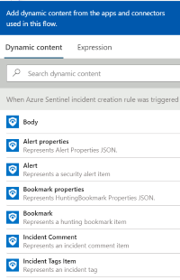
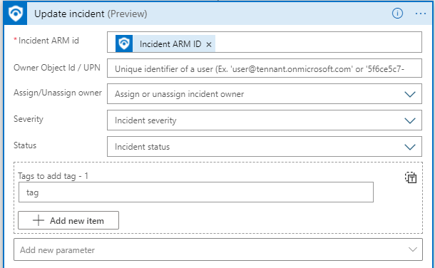
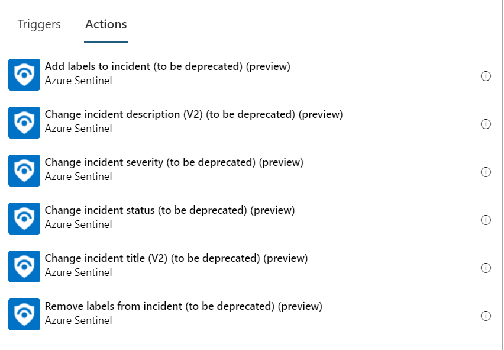
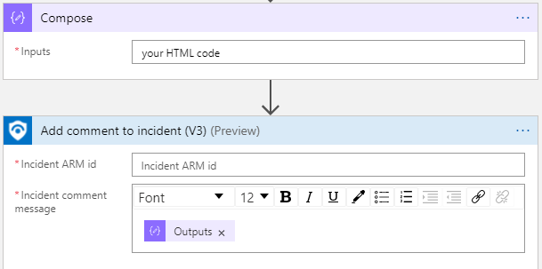
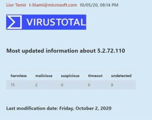
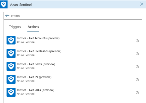

# Playbook templates update required

Due to recent changes in Azure Sentinel, playbook templates should be updated to use the most recent components of the Azure Sentinel Logic Apps connector. <br>
Below are details about the recent changes and links to relevant documentation for references. 
* Please find in the playbook template you have contributed the required changes listed here.
* Create a new version of the playbook template. 
* We recommend to check if the updates in the Logic Apps connector can improve the current playbook logic (for example, use new formatted comments; add Incident URL to your external messages or tickets; reduce complexity).
* When you are done, create a Pull Request with the corrections. Use the title “connector updates - {playbook name}” and list the changes.

## Introduction: Recent updates in Azure Sentinel which affects playbook templates

* **Introducing incident automation: Automation Rules & new Logic Apps trigger**<br>
    * Launched in April 2021, Automation rules are a new concept in Azure Sentinel which allows users to centrally manage the automation of incident handling. [Learn more about automation rules.](https://docs.microsoft.com/azure/sentinel/automate-incident-handling-with-automation-rules)
    * A new Logic Apps trigger was added to Azure Sentinel connector to allow incident automation triggered by automation rules:  **When Azure Sentinel incident creation rule was triggered**.<br>

* **New actions in Logic Apps connector to replace deprecated actions**<br>
    Azure Sentinel Logic Apps connector was updated to support [incidents API](https://docs.microsoft.com/rest/api/securityinsights/incidents) capabilities, remove deprecated cases API actions and simplify usage. [Learn more about the changes](https://techcommunity.microsoft.com/t5/azure-sentinel/what-s-new-azure-sentinel-logic-apps-connector-improvements-and/ba-p/1888416).

<br><br>


## Required changes in existing playbook templates - summary

|     Old component                  |     New component                     |
|-------------------------------|----------------------------------|
|     When a response to an Azure Sentinel alert is triggered     |     When Azure Sentinel incident creation rule was triggered      |
|     Alert - Get Incident    |     Alert - Get Incident (remove and then add action to get new version)   |
|     Add labels to incident          |     Update Incident         |
|     Remove labels from incident           |     Update Incident           |
|     Change incident description           |     Update Incident          |
|     Change incident severity      |     Update Incident      |
|     Change incident status    |     Update Incident    |
|     Change incident title         |     Update Incident         |
|     Add comment to incident (V2)           |     Add comment to incident (V3)           |
|     Alert – Get Accounts      |     Entities – Get Accounts      |
|     Alert – Get FileHashes    |     Entities – Get FileHashes    |
|     Alert – Get Hosts         |     Entities – Get Hosts         |
|     Alert – Get IPs           |     Entities – Get IPs           |
|     Alert – Get URLs          |     Entities – Get URLs          |

<br><br>

## Required changes in existing playbook templates - extended information

### Trigger change: playbook are reccomended be triggered with “When Azure Sentinel incident creation rule was triggered”

**Required change:** Playbooks which start with alert trigger (“When a response to an Azure Sentinel alert is triggered”) 
are highly recommended to use the Incident trigger (“When Azure Sentinel incident creation rule was triggered”). 


**Case playbook require both incident and alert trigger vesrion:**<br>
Since manual trigger for incident trigger not yet available, if the playbook is relevant for manual trigger please have both versions.<br>
Folder structure in this case:
* incident-trigger (folder)
   * images (folder)
   * azuredeploy.json
* alert-trigger (folder)
   * images (folder)
   * azuredeploy.json
* readme.md 

```json
# {PLAYBOOKNAME}
author: 

description

## Quick Deployment
**Deploy with incident trigger** (recommended)

After deployment, attach this playbook to an **automation rule** so it runs when the incident is created.

[Learn more about automation rules](https://docs.microsoft.com/azure/sentinel/automate-incident-handling-with-automation-rules#creating-and-managing-automation-rules)

<a href="https://portal.azure.com/#create/Microsoft.Template/uri/https%3A%2F%2Fraw.githubusercontent.com%2FAzure%2FAzure-Sentinel%2Fmaster%2FPlaybooks%2F{PLAYBOOKNAME}%2Fincident-trigger%2Fazuredeploy.json" target="_blank">
    
</a>
<a href="https://portal.azure.us/#create/Microsoft.Template/uri/https%3A%2F%2Fraw.githubusercontent.com%2FAzure%2FAzure-Sentinel%2Fmaster%2FPlaybooks%2F{PLAYBOOKNAME}%2Fincident-trigger%2Fazuredeploy.json" target="_blank">

</a>

**Deploy with alert trigger**

After deployment, you can run this playbook manually on an alert or attach it to an **analytics rule** so it will run when an alert is created.

<a href="https://portal.azure.com/#create/Microsoft.Template/uri/https%3A%2F%2Fraw.githubusercontent.com%2FAzure%2FAzure-Sentinel%2Fmaster%2FPlaybooks%2F{PLAYBOOKNAME}%2Falert-trigger%2Fazuredeploy.json" target="_blank">
    
</a>
<a href="https://portal.azure.us/#create/Microsoft.Template/uri/https%3A%2F%2Fraw.githubusercontent.com%2FAzure%2FAzure-Sentinel%2Fmaster%2FPlaybooks%2F{PLAYBOOKNAME}%2Falert-trigger%2Fazuredeploy.json" target="_blank">

</a>

## Prerequisites
None

## Screenshots
**Incident Trigger**<br>

<br>
**Alert Trigger**<br>

```


**Additional value to consider when making the change:** 
* Incident trigger recieves as an input:
    * Incident properties
    * Alerts and their properties 
    * Entities
* Note that you might not need to work with the alerts. For example, **Incident Alert product names** is a list of alert providers in this incident, **Incident Description, Title, Severity, Created time** can be used instead of the respective alert fields and **Incident URL** allows a direct pivot to Sentinel.<br> 

* This eliminates the need for "Alert - Get Incident".
* Identify to **Update Incident**/**Add comment to incident (V3)** using **Incident ARM ID**

### Action change: "Alert - Get Incident"
**Required change:** Use the latest version of "Alert - Get Incident", which works on Incidents API (instead of Cases API).

**Instructions:** 
* Remove the old component and re-select the action “Alert – Get Incident”. 
* For validation, you can use “pick code” or Logic Apps code view. New version path starts with "path": "/incidents” (old version used "path": "/Cases”).<br>


**Additional value to consider when making the change:** 
* Improve your logic using the new incident fields this version fetches, such as incident URL.
* If required, identify to **Update Incident**/**Add comment to incident (V3)** using **Incident ARM ID**.

### Action change: Old “Change incident” actions should be replaced by “Update Incident”
**Required change:** 
<br>Remove any of the following actions: 
* Add labels to incident 
* Remove labels from incident 
* Change incident description 
* Change incident severity 
* Change incident status 
* Change incident title

and add **Update Incident** instead.
Fill in only fields you want to change.

To identify, this action requires **Incident ARM ID**. 
* If playbook starts with incident trigger, Incident ARM ID is a dynamic field of the trigger. 
* If you chose to keep the playbook to work with alert trigger, use the **Alert - Get Incident** action beforehand to get Incident ARM ID. See [usage examples](https://docs.microsoft.com/connectors/azuresentinel/#actions-on-incidents---usage-examples).

New action:<br>
    <br>
Actions to be deprecated:<br>
    

**Additional value to consider when making the change:** 
* If you had multiple changes on the incident in separated steps, you can use one step of Update Incident to do multiple changes.

### Action change: Add comment to incident should be replaced with new version (V3)
**Required change:** 
Remove previous version of Add comment to incident, and add version V3.<br><br>
To identify, this action requires **Incident ARM ID**. 
* If playbook starts with incident trigger, Incident ARM ID is a dynamic field of the trigger. 
* If you chose to keep the playbook to work with alert trigger, use the **Alert - Get Incident** action beforehand to get Incident ARM ID. See [usage examples](https://docs.microsoft.com/connectors/azuresentinel/#actions-on-incidents---usage-examples).

**Additional value to consider when making the change:** 
* New version supports HTML and Marksdown, so you can create rich formatted comments:
    * Use the HTML editor for simple formatting.
    * Add a previous step of “Compose” built in action to implement raw HTML code. Then, use the output as an input to the comment.
    <br>
    

### Action change: “Alert – Get {entity type}” should be replaced with “Entities – Get {entity type}”

|     Old name                  |     New name                     |
|-------------------------------|----------------------------------|
|     Alert – Get Accounts      |     Entities – Get Accounts      |
|     Alert – Get FileHashes    |     Entities – Get FileHashes    |
|     Alert – Get Hosts         |     Entities – Get Hosts         |
|     Alert – Get IPs           |     Entities – Get IPs           |
|     Alert – Get URLs          |     Entities – Get URLs          |


